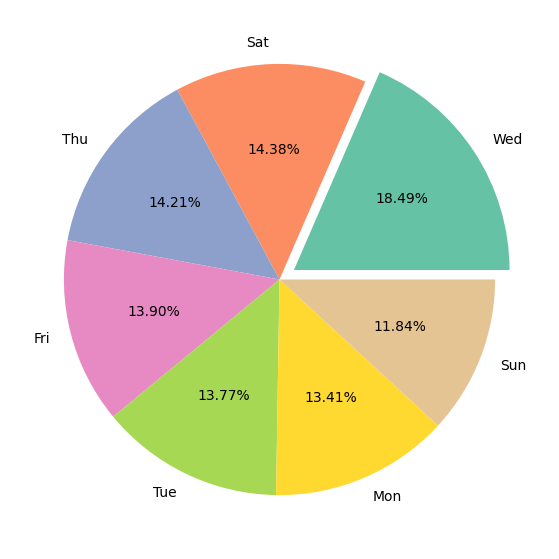

# Delhivery Business Case Analysis

## 📦 Project Overview

This project analyzes shipment and delivery performance data for **Delhivery**, focusing on optimizing delivery operations, identifying inefficiencies, and drawing actionable business insights. The dataset comprises over 144,000 delivery records, capturing route information, delivery times, distances, shipment types, and more.

## ✅ Why This Project Is Useful

- Helps **identify inefficiencies** in delivery time tracking (e.g., discrepancies between system-logged and expected delivery times).
- Provides insights into **regional delivery trends**, including most active source and destination locations.
- Enables data-driven decisions for **route optimization** and **resource allocation**.
- Quantifies **route-type performance** (Carting vs. FTL), offering recommendations on when to use which.
- Supports anomaly detection (e.g., ~11% outliers) that can be investigated further to improve system reliability.

## 🚀 How to Get Started

1. **Clone this repo** or download the files.
2. Ensure you have the following installed:
   - Python 3.7+
   - `pandas`, `numpy`, `matplotlib`, `seaborn`, `scipy`, `sklearn`
3. Place the `delhivery_data.csv` file in your working directory.
4. Run the Colab Notebook:  

## 📊 Key Graphs & Visualizations

### 1. Route Type Distribution

> Insight: Carting accounts for ~60% of all shipments and is significantly faster than FTL (Full Truck Load).

### 2. Delivery Trends by State

> Insight: Maharashtra and Karnataka dominate delivery volume as both source and destination states.

*(You can export these graphs from your notebook using `plt.savefig()` and replace the `path/to/...` with actual image paths.)*

## 🧠 Insights Summary

- **Carting shipments** are faster than FTL, especially for short distances.
- **Wednesdays** see the highest number of deliveries (18.5%), while weekends are low.
- **Gurgaon (Haryana)** has the longest average delivery distances.
- **High correlation** between segment-level and overall time metrics implies redundancy in granular metrics.
- **Outliers** (~11%) indicate possible data anomalies or delivery delays needing further review.
- **Discrepancy** between `start_scan_to_end_scan` and `total_min_diff` suggests potential inefficiencies in scan logging or system syncing.

## ❓Need Help?

If you encounter issues running the notebook or want to discuss the business insights further, feel free to reach out on [LinkedIn](https://www.linkedin.com/) or raise an issue in the repository.

---

